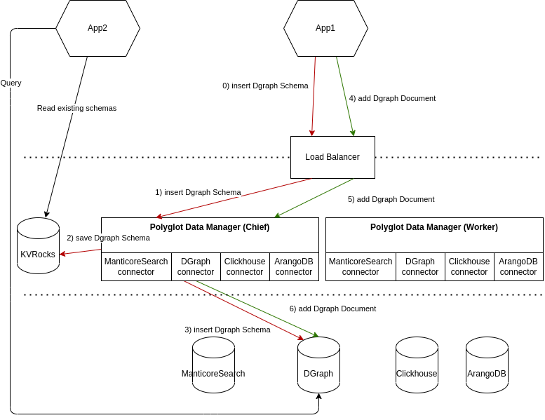

Architecture
============

This tools was designed to be very simple.
It runs a small api server that will execute requests on supported databases.
The goal is to manage all schemas from this APIs and be able to write data without thinking what is the correct syntax to run on the targeted database.

This tool will not be an ETL/ELT or anything that transforms or read your data.
It's an abstraction layer to write data and manage schema more easily. But it will be possible to have an ETL, a worflow or anything else in front of this tool.

This API could be execute with 2 modes :

* Chief : it allows the API to manage all of your schemas. There should be only one chief !
* Worker : it allows to deploy more nodes to handle more write requests.

